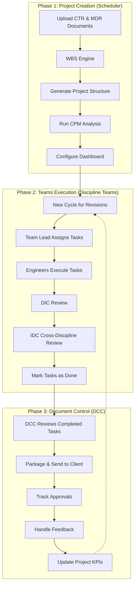

# PMFusion: Three-Phase Workflow Blueprint

This document serves as the North Star for implementing the three-phase workflow (Project Creation → Teams Execution → Document Control) in the PMFusion platform. It outlines the core roles, interfaces, flows, and technical requirements to guide development.

## 1. Core Roles & Permission Model

| Role                                  | Key Powers                                                           | Typical Screens                                 | Row-Level-Security (Supabase)                           |
| ------------------------------------- | -------------------------------------------------------------------- | ----------------------------------------------- | ------------------------------------------------------- |
| **Org Owner / Admin**                 | Add/remove users & disciplines, manage billing, global settings      | Admin Portal                                    | `org_id = current_setting('jwt.org_id')`                |
| **Scheduler** (initial phase)         | Create project, upload/parse bid docs, run WBS + CPM engine          | Project-Wizard, WBS Studio, Portfolio Dashboard | Same as Admin but scoped to their projects              |
| **Team Lead**                         | Accept synced backlog items, assign/reassign, approve DIC, start IDC | Kanban, Discipline Dashboard, Task Detail       | `discipline_id` AND `project_id` match token            |
| **Team Member**                       | View/execute assigned cards, check comments, upload versions         | My Tasks, Task Detail                           | Same as Team Lead but *only* `assignee_id = auth.uid()` |
| **DCC Officer**                       | Outbound to clients, record approvals, loop feedback to teams        | DCC Queue, Client Tracker                       | `dcc = true` flag on user table                         |
| **Client Reviewer** (optional portal) | Read-only to review packages, approve/reject                         | Client Review Portal                            | `role = 'client'` limited views                         |

*Authentication is managed through Supabase Auth. JWT claims carry `org_id`, `user_role`, `discipline_id`, etc. All tables have Row-Level Security (RLS) policies enforcing these claims.*

## 2. Key Interfaces & Views

### 2.1 Project-Creation Wizard (Scheduler)

1. **Step 1 – Basic Info**
   - Modal or full-page wizard with fields for:
     - Project name
     - Project code
     - Client name
     - Start date
     - End date

2. **Step 2 – Document Intake**
   - Drag-and-drop zone for CTR, MDR, milestone PDFs/Excels
   - Toggle between **"Use OCR/Parser"** or **"Manual entry"**
   - Progress bar showing pages parsed and entities extracted

3. **Step 3 – WBS & CPM Preview**
   - Tree grid (indent/expand) of activities
   - Inline editing of durations and dependencies
   - "Run Critical-Path" button that highlights the critical chain and calculates float

4. **Step 4 – Dashboard Seed**
   - Selection of starter widgets (Gantt, S-Curve, Resource histogram, KPI cards)
   - Finish button generates the **Project Dashboard** and pushes activities to the "Teams" phase

### 2.2 Discipline Workspace (Teams Phase)

| Area             | Component                                                                                                                        | Purpose |
| ---------------- | -------------------------------------------------------------------------------------------------------------------------------- | ------- |
| **Left-Rail**    | Projects-Directory with discipline-specific list (with unread badges); Profile; Settings                                          | Navigation and context switching |
| **Header**       | Quick-Switch project drop-down, global search (tasks/docs), notification bell                                                     | Global actions and awareness |
| **Main**         | **Kanban Board** with lanes *Backlog → To-Do → In-Progress → Review (DIC/IDC) → Done*                                            | Core workflow visualization |
| **Task Card**    | Title, WBS code, resource tags, due date, assignee, status pills, file stack (latest version visible), comment icon, audit icon   | Task information and actions |
| **Right Drawer** | **Task Detail** – version tree, comment thread (Markdown), change log, assignment history                                         | Detailed task management |

*The interface uses Supabase Realtime channels for live updates, with optimistic UI for drag-and-drop operations.*

### 2.3 Discipline Register & Roster

- Admin-only table view showing:
  - Discipline name
  - Color
  - Default WIP limit
  - Active members
- "Add member" modal (search existing users → set role → invite)
- Used by the WBS sync job to map **WBS.activity.discipline** → board backlog

### 2.4 Document Control Centre (DCC Phase)

1. **Incoming Queue** (from Teams → Done)
   - Table with filters (project, discipline, stage, rev)
   - Bulk select & send to client (email / API / manual upload)

2. **Outbound Tracker**
   - Status pills: *Sent • Pending • Approved • Rejected*
   - SLA counters (days outstanding)

3. **Feedback Loop**
   - Upload returned file → attach comments → click **"Return to Teams"**
   - Automatically re-opens task card in "Review" lane, notifies Team Lead & Member

4. **Metrics Panel**
   - Pie charts of documents per stage
   - Lead times
   - Percentage of approvals on first-pass

### 2.5 Project Dashboard (cross-role)

- KPI bar displaying:
  - Percentage complete
  - Critical path length vs baseline
  - Earned value
- Widgets:
  - Gantt chart
  - S-curve
  - Burndown chart
  - Resource loading
  - Milestone traffic-lights
- All metrics powered by Postgres materialized views refreshed via triggers

## 3. Experience Flows (Happy Path)

### 3.1 Linear Flow

### 3.2 Three-Phase Visualization

**Error/feedback branches:**
- Tasks rejected during review loop back to the Kanban board with state transitions:
  - `Review → In-Progress (with comment)`
  - `Client Rejected → DCC → Teams (Review lane)`

## 4. Supporting System Requirements

| Area                 | Tech / Service                                                                                                       | Notes |
| -------------------- | -------------------------------------------------------------------------------------------------------------------- | ----- |
| **Parsing/OCR**      | Serverless function wrapping Tesseract + structured parsers; drop zone streams to it                                  | Used for document intake in Project Creation phase |
| **WBS & CPM Engine** | Node micro-service (worker queue) using `criticalpath-js`; writes to `activities`, `links`, `cpath` tables           | Core scheduling engine for project planning |
| **Realtime**         | Supabase Realtime channels (postgre_pubsub)                                                                         | Enables live collaboration in Kanban boards |
| **Storage**          | Supabase Storage → S3; with signed URLs for task files                                                               | Document storage and version management |
| **Versioning**       | `documents` table with `major`, `minor`, `rev`, `parent_id`, and `supersedes_id`; storage object names include hash  | Tracks document versions and relationships |
| **Notifications**    | `user_events` channel → in-app toast + optional email                                                                | Alerts users about changes and actions required |
| **RLS policies**     | Centralized SQL snippets by `org_id`, `project_id`, `discipline_id`, plus role checks                               | Security enforcement at database level |
| **Audit-Trail**      | `activity_log` table (trigger on inserts/updates); surfaced via side drawer                                          | Tracking all changes for compliance and visibility |
| **Analytics**        | Materialized views refreshed in-DB; D3/Recharts on frontend                                                          | Powers dashboards and reporting |

## 5. Design Language & Components

- **Next.js + shadcn/ui** component library (already chosen)
- Theme tokens for each discipline color (used on cards, avatars)
- Motion: Framer-motion slide-overs, drag ghosts, progress bars
- Accessibility: keyboard-navigable Kanban, aria-live regions for real-time updates
- Responsive: breakpoints for Kanban to collapse to vertical lanes on mobile

## 6. Open Questions / Next Decisions

1. **OCR vs manual** – agree MVP scope: start with structured Excel upload ➜ add OCR later
2. **Client portal** – required day 1 or later?
3. **Granular resource-level CPM** – in first release or iterate after basic critical path?
4. **Doc e-signature & watermarking** – part of DCC or separate module?

## 7. Implementation Roadmap

### Phase 1: Foundation & Project Creation

1. **User Authentication & Role System**
   - Implement Supabase Auth with JWT claims
   - Setup RLS policies for all database tables
   - Create user management screens

2. **Project Creation Wizard**
   - Build 4-step wizard UI
   - Implement document intake (start with manual, plan for OCR)
   - Create WBS tree builder interface
   - Set up CPM calculation service

### Phase 2: Teams Execution

1. **Kanban Board & Discipline Views**
   - Implement the Kanban board with lanes and drag-drop
   - Build task card component with all required fields
   - Create task detail view with version control
   - Set up real-time updates with Supabase Realtime

2. **Discipline Management**
   - Build discipline register and roster views
   - Implement WBS-to-Kanban sync job

### Phase 3: Document Control

1. **DCC Interfaces**
   - Create document queue views
   - Implement outbound tracker
   - Build feedback loop mechanism
   - Set up document metrics

2. **Analytics & Dashboards**
   - Build project dashboard with widgets
   - Set up materialized views for analytics
   - Implement KPI calculations

## 8. Deliverables

* A shared understanding of **who** can do **what**, **where** they do it, and **how** it all ties back into the database and RLS
* Clear starting point for UX wireframes, component inventory, and backend schema migrations
* Checklist of outstanding product decisions before sprint planning 